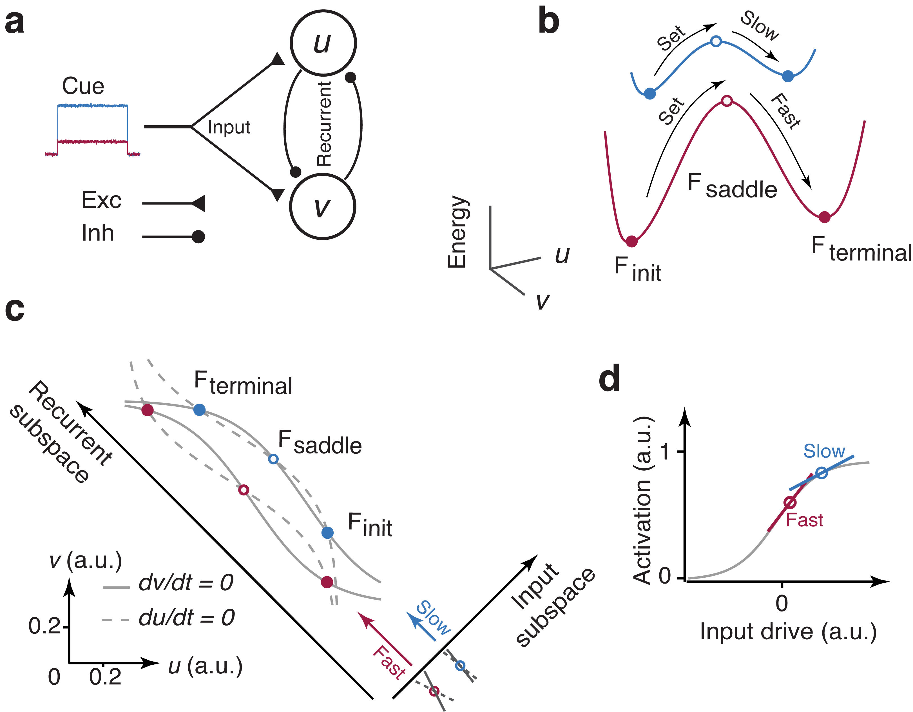

# two-neuron-model

  

Two inhibitory neurons with various level of common input.
It generates the neural trajectories, speed and energy profiles, as shown in Figure 6c and 6b.

Main function 

  	TwoNeuron.m
	
auxiliary functions 

  	findInterset.m 
  	linspecer.m
